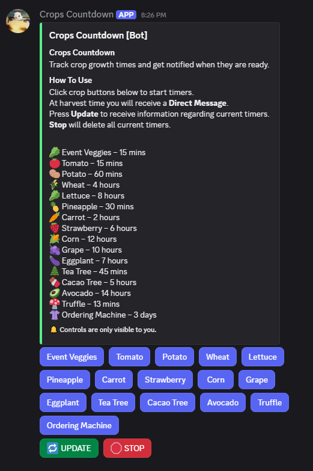
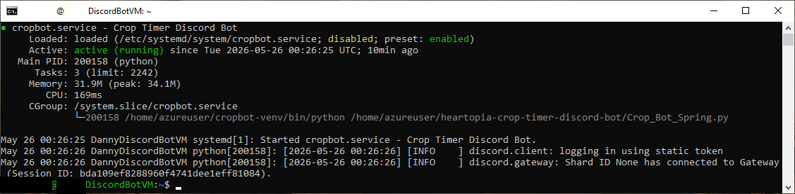

# Heartopia Crop Timer Discord Bot

A cloud-hosted Discord bot for tracking crop growth timers in Heartopia.

Built with Python and deployed on an Ubuntu virtual machine hosted on Microsoft Azure using systemd services for persistent uptime.

## Screenshots

### Discord Embed Interface


### Azure Linux Service Deployment


### Discord Notification Example


## Features

- Crop timer tracking through Discord buttons
- Direct Message notifications when crops are ready
- Persistent interactive embed system
- Usage statistics tracking
- Systemd service deployment for automatic uptime
- Environment variable secret management
- Cloud-hosted Linux deployment
- Persistent button support after bot restarts

---

## Technologies Used

- Python
- discord.py
- Microsoft Azure VM
- Ubuntu Linux
- systemd
- Virtual Environments (venv)
- Git & GitHub

---

## Security Improvements

Originally, the Discord bot token and server information were stored directly inside the Python source code.

The project was refactored to use environment variables through a `.env` file and `python-dotenv` to prevent secrets from being exposed in source control.

This allows the repository to be safely uploaded publicly to GitHub.

---

## Persistent Embed System

Earlier versions of the bot required reposting the crop embed after service restarts because Discord UI components were not being re-registered on startup.

This was resolved by:

- Using persistent Discord views
- Re-registering the button view during `on_ready()`
- Saving embed configuration information in a JSON config file

This allows the original embed and buttons to continue functioning after the bot service restarts without needing manual reposting.

---

## Project Structure

```text
heartopia-crop-timer-discord-bot/
│
├── Crop_Bot_Spring.py
├── usage_stats.json
├── bot_config.json
├── .gitignore
└── .env (local only, not uploaded)
